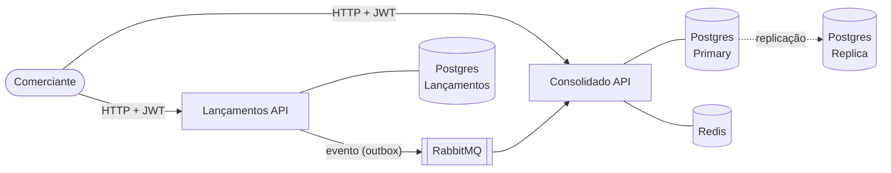
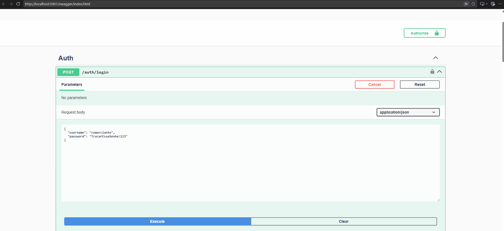
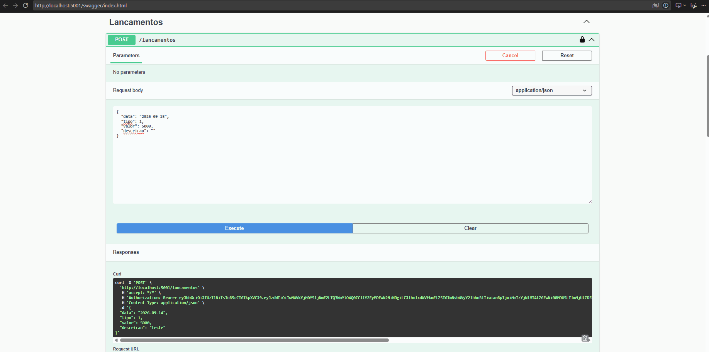
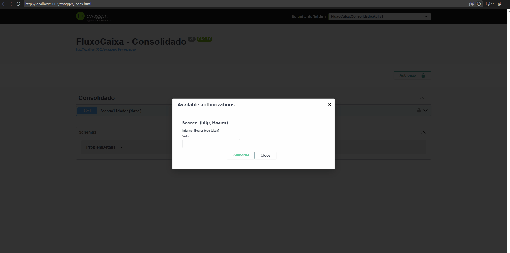
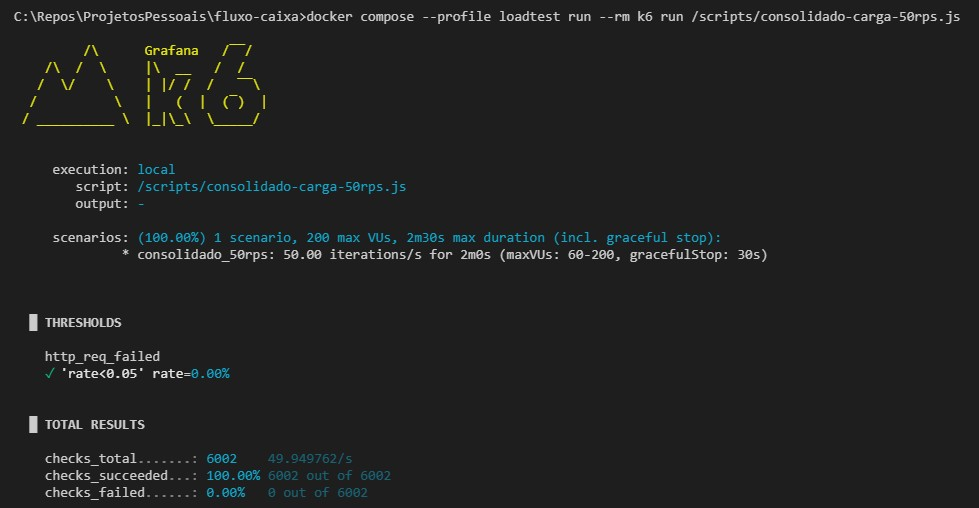
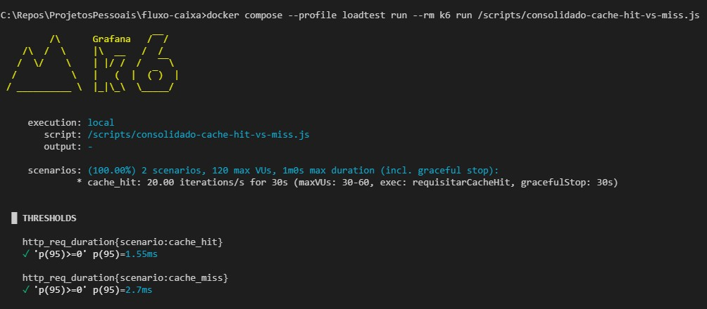
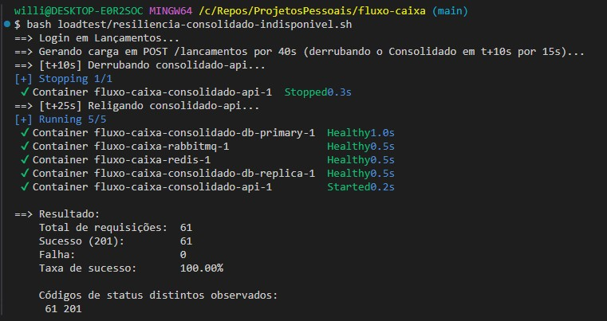

# FluxoCaixa — Controle de Fluxo de Caixa

Solução para o desafio técnico de Arquiteto de Software: um comerciante controla seus lançamentos
(débitos/créditos) diários e consulta um relatório de saldo consolidado por dia.

O desafio original está em [`desafio-arquiteto-software.pdf`](desafio-arquiteto-software.pdf).
Este documento explica **como rodar o projeto** e resume as decisões de arquitetura; o *porquê* de
cada decisão está detalhado nas [ADRs](docs/adr/) (Architecture Decision Record).

## Sumário

- [FluxoCaixa — Controle de Fluxo de Caixa](#fluxocaixa--controle-de-fluxo-de-caixa)
- [Sumário](#sumário)
- [Arquitetura em uma imagem](#arquitetura-em-uma-imagem)
- [Como rodar localmente](#como-rodar-localmente)
- [Como testar (Swagger)](#como-testar-swagger)
- [Como rodar os testes automatizados](#como-rodar-os-testes-automatizados)
- [Decisões arquiteturais (ADRs)](#decisões-arquiteturais-adrs)
- [Requisitos não funcionais — como foram endereçados](#requisitos-não-funcionais--como-foram-endereçados)
- [Testes de carga (k6)](#testes-de-carga-k6)
- [Estrutura do repositório](#estrutura-do-repositório)
- [Padrões de projeto e boas práticas aplicadas](#padrões-de-projeto-e-boas-práticas-aplicadas)
- [Evoluções futuras](#evoluções-futuras)

## Arquitetura em uma imagem

Dois microsserviços em C#/.NET 8, comunicando-se **apenas via RabbitMQ** (nenhuma chamada HTTP
direta entre eles):

- **Lançamentos** — recebe débitos/créditos, é a fonte da verdade transacional.
- **Consolidado** — mantém o saldo diário agregado, otimizado para leitura em alto volume.



Diagrama completo, com o passo a passo do fluxo: [`docs/diagrams/solution-flow.md`](docs/diagrams/solution-flow.md).

Isso é o que garante o requisito não-funcional central do desafio: **o serviço de Lançamentos não
fica indisponível se o Consolidado cair** — eles só trocam mensagens assíncronas, nunca fazem
chamadas síncronas um ao outro.

## Como rodar localmente

Pré-requisitos: **Docker** e **Docker Compose** (não precisa de .NET SDK instalado para subir a
aplicação — o SDK só é necessário se for rodar os [testes automatizados](#como-rodar-os-testes-automatizados)
fora de container).

Execute os comandos abaixo a partir da **raiz do repositório** (pasta `fluxo-caixa`, onde está este
README) — é de lá que o `.env` é lido e que o `docker-compose.yml` referencia os `Dockerfile` de
cada serviço.

```bash
cp .env.example .env
# (opcional) edite o .env para trocar segredos/credenciais de demonstração
docker-compose up --build
```

> No `cmd.exe` do Windows não existe `cp` — use `copy .env.example .env` (no PowerShell, `cp` funciona normalmente como alias de `Copy-Item`).

Isso sobe: os dois serviços, dois bancos Postgres para Lançamentos, um par primary+replica de
Postgres para o Consolidado, RabbitMQ (com painel de administração) e Redis. As migrations do EF
Core rodam automaticamente no startup de cada serviço, incluindo o *seed* do usuário único do
sistema.

Serviços expostos:

| Serviço | URL | Descrição |
|---|---|---|
| Lançamentos API | http://localhost:5001/swagger | Login, criar/consultar lançamentos |
| Consolidado API | http://localhost:5002/swagger | Consultar saldo diário |
| RabbitMQ Management | http://localhost:15672 | Painel de filas (usuário/senha do `.env`) |
| Adminer | http://localhost:8080 | UI web para os 3 Postgres — Sistema: `PostgreSQL`, Servidor: `lancamentos-db`, `consolidado-db-primary` ou `consolidado-db-replica`, usuário/senha do `.env` |
| Redis Commander | http://localhost:8081 | UI web para o Redis (chaves de cache do relatório consolidado) |

> Adminer e Redis Commander são só ferramentas de inspeção para acompanhar os dados durante o
> desenvolvimento/avaliação — não fazem parte da arquitetura da solução.

Os três bancos Postgres e o Redis também têm as portas expostas para quem preferir um cliente
desktop (DBeaver, Azure Data Studio, RedisInsight, etc.):

| Banco | Host:Porta | Usuário/senha |
|---|---|---|
| Lançamentos | `localhost:5433` | `LANCAMENTOS_DB_USER`/`LANCAMENTOS_DB_PASSWORD` do `.env` |
| Consolidado (primary) | `localhost:5434` | `CONSOLIDADO_DB_USER`/`CONSOLIDADO_DB_PASSWORD` do `.env` |
| Consolidado (replica) | `localhost:5435` | idem primary (mesmas credenciais, banco replicado) |
| Redis | `localhost:6379` | sem autenticação (uso local) |

## Como testar (Swagger)

1. Abra http://localhost:5001/swagger e use `POST /auth/login` com o usuário seed
   (`SEED_USER_USERNAME`/`SEED_USER_PASSWORD` do seu `.env`, por padrão `comerciante` /
   `TrocarEssaSenha!123`).
2. Copie o `token` retornado e clique em **Authorize** no topo do Swagger, informando apenas o 
   `{token}`.

   
   
3. Use `POST /lancamentos` para criar um crédito ou débito, faça quantos lançamentos desejar.
   
   

4. Abra http://localhost:5002/swagger, repita o **Authorize** com o mesmo token (o Consolidado
   valida o mesmo JWT, sem precisar logar de novo) e consulte
   `GET /consolidado/{data}` (formato `yyyy-MM-dd`) para ver o saldo do dia.

   

> O consumo do evento pelo Consolidado é assíncrono — pode levar um ou dois segundos entre criar o
> lançamento e o saldo aparecer atualizado no relatório (consistência eventual, ver
> [ADR 0002](docs/adr/0002-integracao-assincrona-rabbitmq.md)).

## Como rodar os testes automatizados

Requer **.NET 8 SDK** instalado (diferente de "Como rodar localmente" acima, que só precisa de
Docker). Rode os comandos a partir da raiz do repositório.

```bash
# Testes unitários (não precisam de Docker)
dotnet test tests/FluxoCaixa.Lancamentos.UnitTests
dotnet test tests/FluxoCaixa.Consolidado.UnitTests

# Testes de integração da API de Lançamentos (sobem Postgres+RabbitMQ via Testcontainers - requer Docker rodando)
dotnet test tests/FluxoCaixa.Lancamentos.IntegrationTests

# Teste E2E do fluxo completo: lançamento -> evento -> saldo consolidado (requer Docker rodando)
dotnet test tests/FluxoCaixa.E2ETests
```

Ou, para rodar tudo de uma vez: `dotnet test FluxoCaixa.slnx`.

## Decisões arquiteturais (ADRs)

| ADR | Decisão |
|---|---|
| [0001](docs/adr/0001-microsservicos-vs-monolito.md) | Microsserviços (não monólito) |
| [0002](docs/adr/0002-integracao-assincrona-rabbitmq.md) | Integração assíncrona via RabbitMQ/MassTransit |
| [0003](docs/adr/0003-database-per-service-e-read-replica.md) | Database per service + read replica no Consolidado |
| [0004](docs/adr/0004-transactional-outbox.md) | Transactional Outbox em Lançamentos |
| [0005](docs/adr/0005-cache-redis-relatorio.md) | Cache Redis (cache-aside) no relatório |
| [0006](docs/adr/0006-autenticacao-jwt-bcrypt-pepper.md) | Autenticação JWT, usuário seed, BCrypt + pepper |
| [0007](docs/adr/0007-idempotencia-e-incremento-atomico.md) | Idempotência + incremento atômico (sem garantir ordem) |
| [0008](docs/adr/0008-docker-compose-e-kubernetes.md) | docker-compose para rodar localmente; Kubernetes documentado como deploy-alvo |

## Requisitos não funcionais — como foram endereçados

- **Escalabilidade**: leitura do Consolidado escalada via read replica (0003) + cache Redis (0005);
  em produção, `HorizontalPodAutoscaler` do Kubernetes escalaria réplicas por carga (0008).
- **Resiliência**: Lançamentos nunca depende da disponibilidade do Consolidado (0001, 0002);
  Transactional Outbox garante que nenhum lançamento fica sem seu evento publicado, mesmo com o
  broker temporariamente indisponível (0004); health checks (`/health`) em ambos os serviços
  verificam banco, RabbitMQ (e Redis, no Consolidado) para monitoramento proativo.
- **Segurança**: autenticação JWT obrigatória em todos os endpoints de negócio; senha com
  BCrypt (salt) + pepper (0006); segredos via variáveis de ambiente, nunca commitados.
- **Confiabilidade/Integridade**: idempotência no consumer evita contagem duplicada de eventos
  redentregues; incremento atômico no banco evita *lost update* sob concorrência (0007).
- **Disponibilidade e perda tolerável (50 req/s, ≤5% de perda no Consolidado)**: cache + réplica
  absorvem a maior parte da carga de leitura; se o Consolidado cair inteiramente, as mensagens
  ficam retidas no RabbitMQ (filas duráveis) até ele voltar — na prática, o desenho tende a **zero**
  perda de dado de negócio, mesmo a arquitetura tolerando até 5%.

## Testes de carga (k6)

As afirmações da seção acima foram validadas com testes de carga reais (não só teoria de ADR),
usando [k6](https://k6.io/). Scripts em [`loadtest/k6`](loadtest/k6); requer a stack rodando
(`docker-compose up`). O k6 roda como mais um serviço do próprio `docker-compose.yml`, atrás de um
`profile` (`loadtest`) que garante que ele nunca sobe num `docker-compose up` comum — só quando
chamado explicitamente:

```bash
docker compose --profile loadtest run --rm k6 run /scripts/consolidado-carga-50rps.js
```

Esse comando é **idêntico em qualquer terminal** (bash, PowerShell, cmd.exe) — o volume
(`./loadtest/k6:/scripts`) é resolvido pelo Compose a partir do `docker-compose.yml`, não pelo
shell de quem chama, o que evita a pegadinha de sintaxe de path (`$PWD` vs `${PWD}` vs `%cd%`) que
muda de terminal pra terminal. Troque `consolidado-carga-50rps.js` pelo script que quiser rodar
(mesma pasta `loadtest/k6`).

> No **Git Bash** (só nele — testado também em PowerShell e cmd.exe sem precisar disso), prefixe o
> comando com `MSYS_NO_PATHCONV=1`: o MSYS reescreve argumentos que começam com `/` como se fossem
> caminhos do Windows, o que faria `/scripts/...` virar algo como `C:/Program Files/Git/scripts/...`.

| Script | Hipótese testada | Resultado obtido |
|---|---|---|
| [`consolidado-carga-50rps.js`](loadtest/k6/consolidado-carga-50rps.js) | 50 req/s no `GET /consolidado/{data}` com ≤5% de perda (requisito literal do desafio) | **0% de perda**, p95 = 1,64ms |
| [`consolidado-cache-hit-vs-miss.js`](loadtest/k6/consolidado-cache-hit-vs-miss.js) | Cache Redis reduz latência vs. bater na read replica | Cache hit p95 = 1,55ms vs. cache miss p95 = 2,7ms (~1,75x mais lento sem cache) |
| [`resiliencia-consolidado-indisponivel.sh`](loadtest/resiliencia-consolidado-indisponivel.sh) | Lançamentos não fica indisponível se o Consolidado cair | **100% de sucesso** em `POST /lancamentos` com o Consolidado totalmente parado por 15s; eventos represados na outbox foram consumidos sem perda ao religar |

Saída real do terminal para os dois testes k6 acima:




> **`resiliencia-consolidado-indisponivel.sh` roda de forma diferente dos dois scripts acima.** Ele
> não é um script k6 (não entra no container `k6`) — é quem **orquestra** o teste: derruba e
> religa o `consolidado-api` via `docker compose stop/start` no meio da execução, enquanto gera
> carga em `POST /lancamentos` com `curl`. Isso só é possível rodando diretamente no host, com
> acesso ao Docker CLI, não de dentro de um container. Por isso ele é chamado com `bash` direto
> (requer Git Bash, WSL, Linux ou macOS — não roda em PowerShell nem cmd.exe), a partir da raiz do
> repositório, com a stack principal já de pé:
>
> ```bash
> bash loadtest/resiliencia-consolidado-indisponivel.sh
> ```



## Estrutura do repositório

```
├── desafio-arquiteto-software.pdf
├── docker-compose.yml
├── .env.example
├── FluxoCaixa.slnx
├── docker/
│   └── postgres/                # scripts de setup da replicação primary/replica
├── docs/
│   ├── adr/                     # decisões arquiteturais (este README linka todas)
│   └── diagrams/                # solution-flow.md, c4-container.md, c4-component.md
├── loadtest/
│   ├── k6/                      # scripts de teste de carga (k6)
│   ├── results/                 # gráficos gerados pelos testes de carga
│   └── resiliencia-consolidado-indisponivel.sh
├── src/
│   ├── BuildingBlocks/FluxoCaixa.Contracts/   # contrato de evento compartilhado
│   ├── Lancamentos/              # Domain / Application / Infrastructure / Api
│   └── Consolidado/               # Domain / Application / Infrastructure / Api
└── tests/
    ├── FluxoCaixa.Lancamentos.UnitTests/
    ├── FluxoCaixa.Consolidado.UnitTests/
    ├── FluxoCaixa.Lancamentos.IntegrationTests/
    └── FluxoCaixa.E2ETests/
```

Cada serviço segue **Clean Architecture**: `Domain` (entidades e regras de negócio, sem
dependências externas) → `Application` (casos de uso via MediatR, portas/interfaces) →
`Infrastructure` (EF Core, MassTransit, Redis, JWT — implementa as portas) → `Api` (controllers,
composição/DI, Swagger).

## Padrões de projeto e boas práticas aplicadas

O desafio pede explicitamente Design Patterns, padrões de arquitetura e SOLID. Em vez de deixar
isso implícito no código, segue o catálogo do que foi usado, onde, e por quê:

| Padrão / prática | Onde no código | Por quê |
|---|---|---|
| **Clean Architecture** (camadas) | `Domain` → `Application` → `Infrastructure` → `Api` em cada serviço | Domínio sem dependências externas; regras de negócio testáveis isoladamente; Infrastructure é a única camada que conhece EF Core/MassTransit/Redis |
| **SOLID** | Todo o código | SRP: cada handler MediatR faz uma única coisa. DIP: `Application` depende de interfaces (`ILancamentoRepository`, `IOutboxWriter`...), nunca de EF Core diretamente. OCP: novos casos de uso viram novos handlers, sem alterar os existentes |
| **Dependency Injection** | `DependencyInjection.cs` de cada camada (`AddApplication`, `AddInfrastructure`) | Composição do grafo de objetos centralizada e testável; permite substituir implementações reais por fakes/mocks nos testes |
| **Repository Pattern** | `ILancamentoRepository`, `ISaldoDiarioReadRepository`/`ISaldoDiarioWriteRepository`, `IUserRepository` (interfaces na `Application`, implementação na `Infrastructure`) | Isola a Application de detalhes de persistência (EF Core, SQL); permite trocar/mocar sem tocar em regra de negócio |
| **Unit of Work** | `IUnitOfWork` (Lançamentos) | Garante que o lançamento e o registro na outbox sejam commitados juntos, na mesma transação do `DbContext` |
| **CQRS (lite)** | `Application/Lancamentos` (commands) vs `Application/SaldoDiario` (query) em Lançamentos; e sobretudo em Consolidado, onde escrita (primary) e leitura (réplica) usam `DbContext`s e conexões físicas diferentes | Separa o modelo de escrita transacional do modelo de leitura otimizado para os 50 req/s de pico, sem forçar os dois a compartilhar o mesmo shape/banco |
| **Mediator** (MediatR) | Controllers chamam só `IMediator.Send(...)`; nunca injetam handlers diretamente | Desacopla a camada HTTP dos casos de uso; controller fica fino, só traduz request/response |
| **Pipeline / Decorator** | `ValidationBehavior<TRequest,TResponse>` (pipeline behavior do MediatR) | Valida todo command/query automaticamente antes do handler rodar, sem repetir `if (!ModelState.IsValid)` em cada controller |
| **Validator** (FluentValidation) | `CriarLancamentoValidator`, `LoginValidator` | Validação de entrada declarativa e testável, separada da regra de negócio (que continua garantida no domínio como defesa em profundidade — ver `Lancamento.Criar`) |
| **Factory Method** | `Lancamento.Criar(...)`, `SaldoDiario.Novo(...)`, `OutboxMessage.Criar(...)`, `UserAccount.Criar(...)` | Construtores privados + factory estático: impossível criar uma entidade em estado inválido (ex: lançamento com valor negativo) |
| **Options Pattern** | `JwtOptions`, `PasswordHashOptions`, `RabbitMqOptions`, `CacheOptions` (`IOptions<T>`) | Configuração fortemente tipada, testável e lida de forma *lazy* via DI (importante para os testes com `WebApplicationFactory`, que sobrescrevem configuração) |
| **Transactional Outbox** | `OutboxMessage` + `OutboxPublisherService` (detalhado na [ADR 0004](docs/adr/0004-transactional-outbox.md)) | Publica eventos de forma confiável sem acoplar a gravação no banco à disponibilidade do broker |
| **Middleware / Chain of Responsibility** | `ExceptionHandlingMiddleware` | Centraliza a tradução de exceções (validação, regra de negócio, erro inesperado) em respostas HTTP consistentes |
| **Health Check** | `RabbitMqHealthCheck`, `RedisHealthCheck`, `AddNpgSql` | Expõe `/health` para monitoramento proativo (requisito não-funcional de confiabilidade/disponibilidade) |
| **DTO** | `LancamentoDto`, `SaldoDiarioDto`, `LoginResultDto` | A API nunca serializa entidades de domínio diretamente — evita vazar detalhes internos e permite o shape do domínio evoluir sem quebrar o contrato HTTP |

## Evoluções futuras

Itens conscientemente fora do escopo deste desafio, mas que fariam parte de uma evolução real do
sistema:

- **Kubernetes** como deploy-alvo real (Deployment, Service, HPA, PodDisruptionBudget) — detalhado
  no [ADR 0008](docs/adr/0008-docker-compose-e-kubernetes.md).
- **Identity Provider externo** (Keycloak/IdentityServer/Auth0) caso o sistema evolua para
  multiusuário/multi-comerciante — hoje há só um usuário seedado (ver
  [ADR 0006](docs/adr/0006-autenticacao-jwt-bcrypt-pepper.md)).
- **Observabilidade**: correlação de tracing distribuído entre os dois serviços (OpenTelemetry),
  métricas de negócio (lançamentos/min, lag de consolidação) em um dashboard.
- **Circuit breaker/retry com Polly** no consumo de dependências externas, complementando os
  health checks já existentes.
- **Dead-letter queue** explícita e alarme para mensagens que falham repetidamente no consumer do
  Consolidado (hoje o retry do MassTransit já existe, mas sem alerta dedicado).
- **Testes de carga mais completos**: os testes de carga com k6 já validam os 50 req/s, o cache e a
  resiliência (ver [Testes de carga (k6)](#testes-de-carga-k6)) — falta ainda um cenário de estresse
  mais longo (horas, não minutos) pra calibrar TTL de cache e número de réplicas com dados de
  degradação real ao longo do tempo, não só um retrato pontual.
