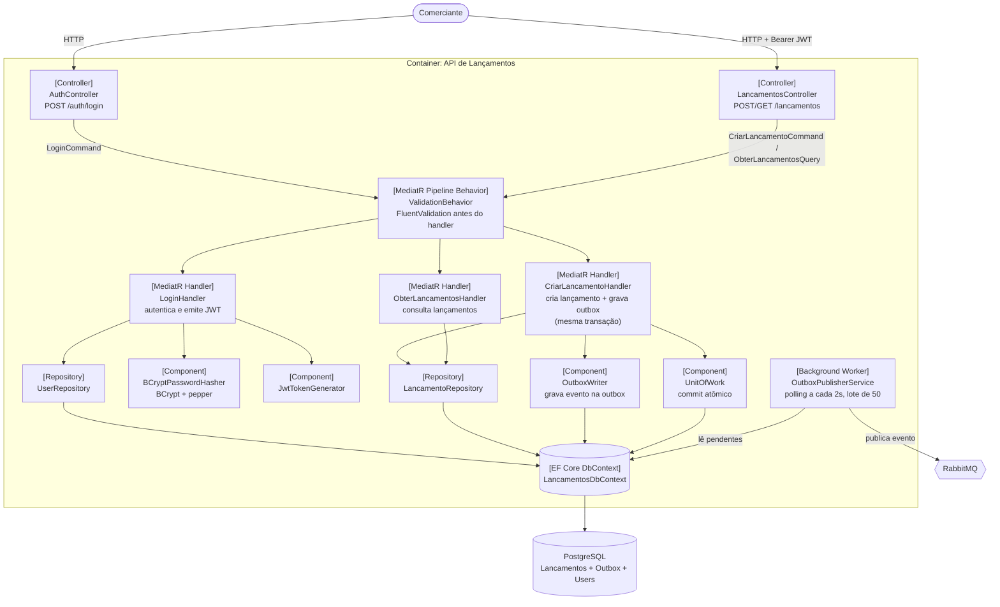
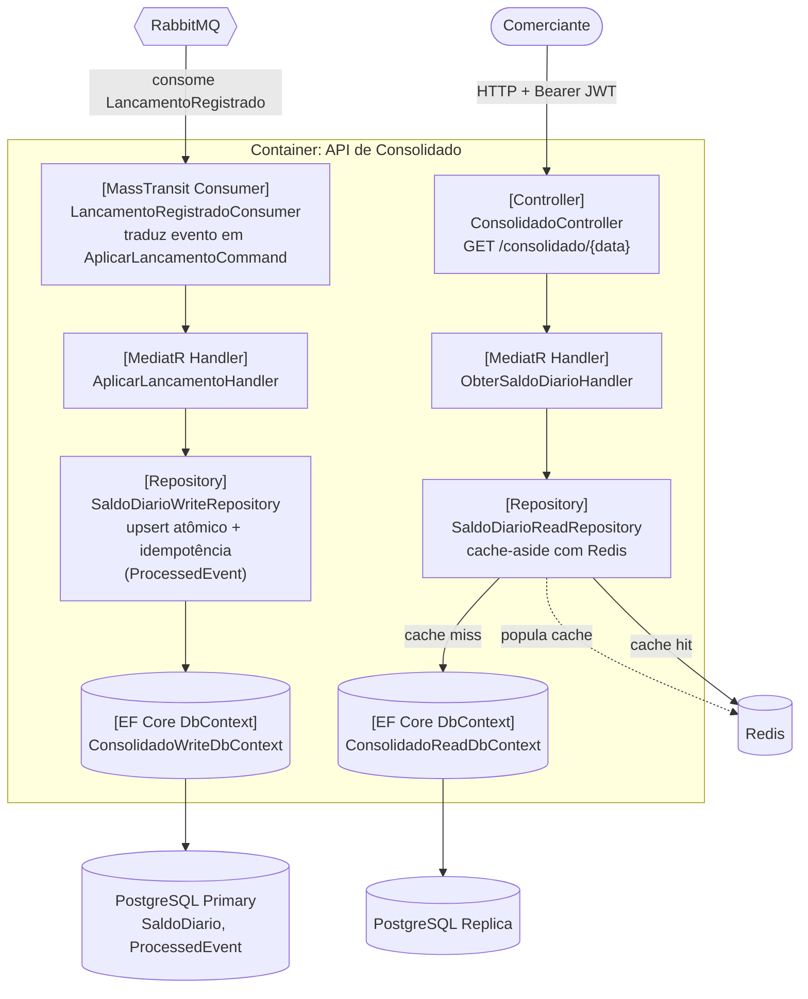

# Diagrama de Componentes (C4 — Nível 3)

Detalha os componentes internos de cada container de aplicação do
[diagrama de container](./c4-container.md) (Nível 2). Um diagrama por serviço, já que cada um é um
container/processo independente e não faz sentido combiná-los num único diagrama de componentes.

## API de Lançamentos

## API de Consolidado

**Legenda**: controllers apenas traduzem HTTP/mensageria em comandos/queries do MediatR; toda regra de
negócio fica nos handlers e nos repositórios de infraestrutura. `SaldoDiarioWriteRepository` nunca é
chamado pelo lado de leitura, e `SaldoDiarioReadRepository` nunca toca o primary — a separação reflete
o [ADR 0003](../adr/0003-database-per-service-e-read-replica.md).
