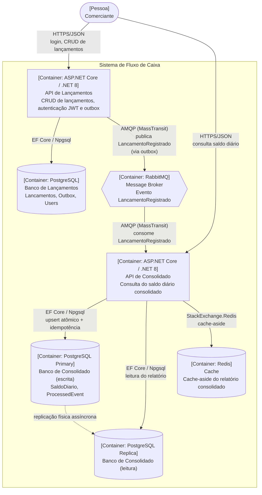

# Diagrama de Container (C4 — Nível 2)

Visão dos containers (unidades implantáveis) que compõem o sistema e como se comunicam entre si.
É a mesma informação do [solution-flow.md](./solution-flow.md), porém no nível de abstração correto
do C4: sem os componentes internos de cada serviço (esses ficam no
[diagrama de componentes](./c4-component.md), Nível 3).

**Legenda**: retângulos são containers de aplicação, cilindros são bancos de dados/cache, o hexágono
é o broker de mensagens. Note que **não existe nenhuma seta direta entre a API de Lançamentos e a API
de Consolidado** — toda comunicação passa pelo RabbitMQ, sustentando a decisão dos
[ADR 0001](../adr/0001-microsservicos-vs-monolito.md) e
[ADR 0002](../adr/0002-integracao-assincrona-rabbitmq.md).
