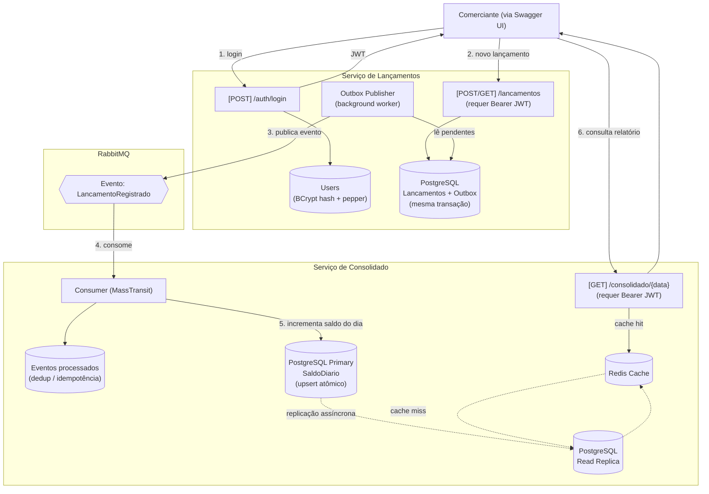

# Fluxo da solução

Visão geral do fluxo entre os dois serviços, cobrindo autenticação, criação de lançamento,
publicação/consumo assíncrono do evento e leitura do relatório consolidado.

**Legenda**: setas sólidas são chamadas síncronas (HTTP); setas tracejadas são fluxo assíncrono
(replicação de banco, cache miss). Os dois serviços só se comunicam pelo RabbitMQ (passos 3→4) —
nenhuma chamada direta entre eles, o que garante o requisito de "Lançamentos não cai se Consolidado
cair" (ver [ADR 0001](../adr/0001-microsservicos-vs-monolito.md) e
[ADR 0002](../adr/0002-integracao-assincrona-rabbitmq.md)).
